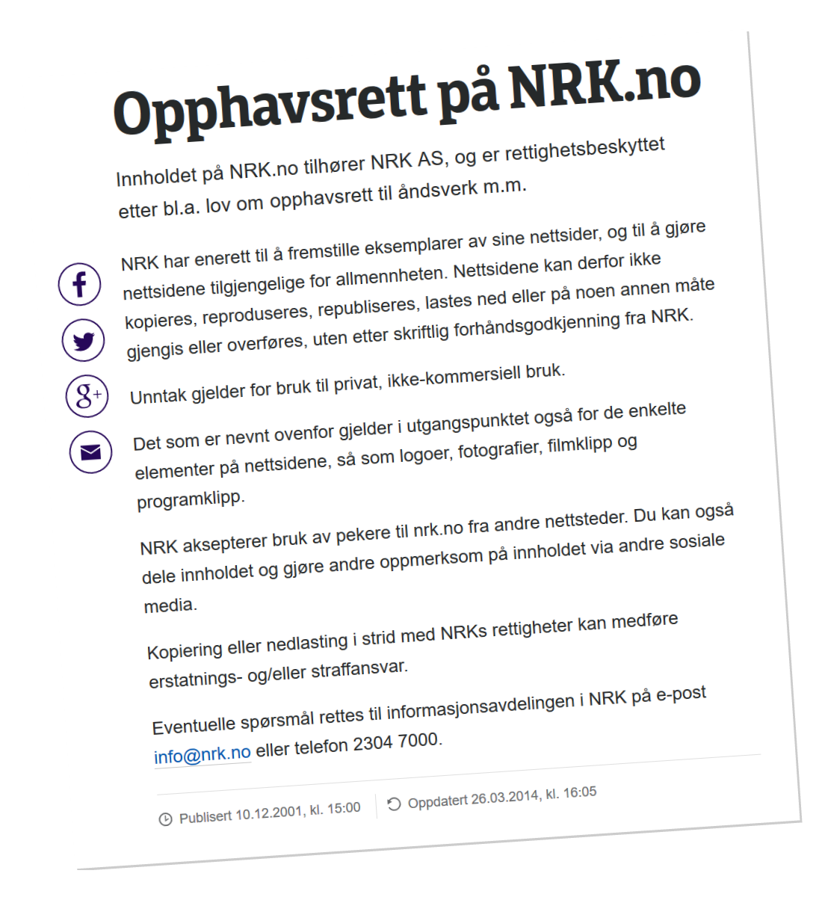

# En plass for diskusjon av NRKs opphavsrett

**Oppsummering:** NRK må endre praksis til å tillate fri gjenbruk, også kommersielt, av så mye av sitt egenproduserte innhold som overhodet mulig. Et verdifullt og enkelt gjennomførbart første steg er å åpne for gjenbruk av all tekst publisert på NRK.no av bedriftens egne journalister/ansatte og av freelancere der NRK har enerett på innholdet. Dette kan gjøres i en håndvending ved å endre ett enkelt avsnitt på NRK.no sin side om opphavsratt.

**Er du enig?** Logg deg inn her på Github og stjernemerk dette "repository"et, og tweet om det til andre interesserte! :-)

**Vil du være med?** Nederst på denne siden er et utkast til en bloggpost som jeg tenker å sende til NRK Ytring. Klask tastaturet på nettbrettet og hiv deg med! Alt er åpent og redigerbart.

**Er du fra NRK?** Kan du komme med en oppfølging på 
1) det begrensede use caset rundt artikkeltekst på NRK.no (se detaljer under), og 
2) deres oppfatning av den siterte Stortingsmeldingen?

## Bakgrunn

[Dette](https://www.nrk.no/etikk/opphavsrett-pa-nrk.no-1.2843522) er NRKs svært lite inspirerende opphavsrettsside slik den fremstår i dag (juli 2016):

> 

Jeg (Bjørn T.) vet ikke en gang om NRK tillater at jeg limer inn teksten fra siden, så jeg nøyer meg med et skjermbilde.

Jeg tenker NRK bør ha en strategi om å publisere så mye som overhodet mulig av sin egenproduksjon som åpen kilde. Mange NRK-ansatte mener dette er en spennende tanke, men begynner fort å problematisere rundt TV-produksjonene sine, der de bruker lisensiert musikk og andre elementer de ikke kan distribuere videre. For å skape framdrift ønsker jeg derfor i første omgang å begrense diskusjonen til å gjelde tekstlig innhold på NRK.no. Jeg mener vi kan ta et stort skritt videre kun ved å endre ett enkelt avsnitt på opphavsrettssiden; det som omhandler unntak.

Det er åpenbart ikke førende for NRK hva enkelte open source-aktivister mener i sakens anledning. Men det er faktisk slik at kringkasterens oppdragsgiver, Regjeringen, har samme syn. Sitat fra Stortingsmeldingen *Open og opplyst – allmennkringkasting og mediemangfald*:

> *[NRKs arkivmateriale skal gjerast tilgjengeleg for vidarebruk](https://www.regjeringen.no/no/dokumenter/meld.-st.-38-20142015/id2423789/?q=NRKs+arkivmateriale+skal+gjerast+tilgjengeleg+for+vidarebruk&ch=7)*.

*Skal*. Ikke *kan* eller *bør*.

### Nåværende avsnitt om unntak

> Unntak gjelder for bruk til privat, ikke-kommersiell bruk.

(Her kunne jo NRK tatt seg bryet med å lese korrektur.)

### Forslag til nytt avsnitt

> Unntak gjelder: 
> 1. For privat, ikke-kommersiell bruk. 
> 2. For all artikkeltekst på nettstedet skrevet av en person med e-post-adresse som slutter med `@nrk.no`. Denne teksten er åpent lisensiert under [CC BY-SA 4.0](https://creativecommons.org/licenses/by-sa/4.0/) og kan gjenbrukes fritt av alle, også til kommersielle formål.

## Opprinnelig e-post til NRK

*Under er en av flere e-poster sendt i sakens anledning til kringkastingssjef og ansvarlig redaktør Thor Gjermund Eriksen (som ikke svarte - men se under for kommentarer fra andre NRK-ansatte). Folk med mer peiling enn meg har for øvrig siden tipset om at [CC BY-SA 4.0](https://creativecommons.org/licenses/by-sa/4.0/) er bedre egnet til formålet enn NLOD.*

**Fra:** Bjørn Tennøe 
**Til:** Thor Gjermund Eriksen 
**Dato:** 20. mars 2014

**Oppsummering:** Kan dere endre opphavsretten på NRK.no til Norsk lisens for offentlige data (NLOD)?

Hei Thor Gjermund,

Bjørn Tennøe her. Jeg er en interaksjonsdesigner som er interessert i tilgang på offentlige norske data.

Tidligere i år skrev jeg til deg fordi NRKs restriktive opphavsrett hindrer gjenbruk av NRK-materiale på andre nettsteder, Wikipedia inkludert. Oppfatningen min er at dette er kontraproduktivt gitt NRKs rolle i samfunnet. Som jeg kort redegjorde for i januar (se e-posten under) har medarbeidere i NRK tidligere tatt til orde for at slike offentlige «*data som vi alt har betalt for [og] som er samlet inn for folket*» burde «*slippes fri*». Derfor: Har dere vurdert å myke opp opphavsretten deres på eksempelvis tekstene journalistene deres publiserer på nrk.no? Norsk lisens for offentlige data (NLOD) bør fungere også for NRK såvidt jeg kan forstå.

Eirik Solheim sin artikkel «[Vær så snill å kopiere meg!](http://nrkbeta.no/2008/10/27/vaer-saa-snill-aa-kopiere-meg/)» fra 2008 viste at NRKs lesere var unisont positive. Allikevel har det ikke skjedd noen endring, så vidt jeg forstår. Hvis NRK ikke kan frigi opphavsretten på materiale selskapet selv har produsert, hva er årsaken til dette? Har det i så fall blitt skrevet en redegjørelse det er mulig å få tilgang til?

Hilsen Bjørn
m. 966 24 730

## Foreløpige svar fra NRK

Via NRK Beta fikk jeg 11. feb. 2016 følgende kommentar fra NRK-advokat Thomas Myhr:

> *Rettighetsbildet hva gjelder åndsverk som NRK gjør offentlig tilgjengelig på sine nettsider er mangefasettert og i mange situasjoner komplisert. Majoriteten av disse åndsverkene har NRK ervervet fra tredjepart. Som utgangspunkt erverver NRK kun rettigheter for egen publisering og ikke for tredjemanns bruk. Dette er et spørsmål om kostnader. På bakgrunn av dette vil det neppe være mulig for NRK å gi en lisens i samsvar med Norsk lisens for offentlige data (NLOD) til denne typen av innhold. Til dette kan det dog nevnes at lenking til NRKs innhold – forutsatt at det skjer i samsvar med EU-domstolens uttalelser i bl.a. Svensson og BestWater – ikke krever samtykke, eller ytterligere rettighetsklarering.*

Jeg fulgte opp:

> (...) Jeg skjønner at åndsverk som NRK har ervervet fra tredjepart ikke kan CC- eller NLOD-lisensieres av dere. Men hva med eks. deres egne tekstlige artikler? Det er ca. 68 artikler på NRKs forside akkurat nå (fredag 12. jan). Bortsett fra matartiklene (curry og suppe) og NTB-artikkelen (om IS) er alle skrevet av en journalist som, når jeg trykker på navnet, har en NRK-epost-adresse. Jeg antar derfor NRK har opphavsrett på alt dette innholdet, selv om noen av journalistene skulle være freelancere? Korriger meg dersom jeg tar feil. (...) Spørsmålet mitt er da: **Hva hindrer CC- eller NLOD-lisensiering av artikkelteksten og fotografiene som er kreditert folk med NRK-epost-adresse?** Og eventuelt samme spørsmål om videoene, hvis NRK har opphavsretten på disse? Kunne ikke opphavsrettssiden deres inkludert noe slikt som: «Artikler og fotografier som er produsert av NRK-medarbeidere er tilgjengelig for videre distribusjon og bearbeidelse under CC BY-SA 4.0»? Som en start. (...)

NRK Beta svarte:

> *Ja, ideelt sett skulle vi ønske at vi kunne, men systemene våre støtter ikke en slik type sortering i dag. Det er tvilsomt om etterspørselen er så stor at en investering i et slikt system ville stått seg gjennom en kost–nytte-analyse. Det ville rett og slett blitt mindre innhold til publikum. Samtidig er artiklene i tillegg dynamiske, så det som ikke inneholder rettighetsbelagt innhold ved første publisering, faktisk kan inneholde dette senere på dagen.*

Da hadde vi imidlertid også diskutert foto, video og databaser fra journalistisk gravearbeid a la [Guardian Open Platform](http://open-platform.theguardian.com/), så jeg prøvde å begrense diskusjonen:

> (...) For å returnere til det mest grunnleggende: **Er det mulig med CC-lisensiering av artikkeltekster på nrk.no som er skrevet at NRK-ansatte?** Slik jeg forstår det, krever det ingen tekniske endringer, kun en oppdatering av opphavsrettsteksten. Når det er drøftet ferdig kan man eventuelt fortsette diskusjonen rundt videre utvidelser :-)

NRK svarte ikke på denne.

Videre diskuterte jeg temaet på NRKbeta med NRKs arkivsjef Svein Prestvik. [Han skrev](https://nrkbeta.no/2016/04/04/slik-tar-vi-vare-pa-nrks-arkiv-for-ettertiden/#comment-671442) blant annet:

> *Creative Commons-lisensiering av egenproduksjon er absolutt interessant, men det er svært få egenproduksjoner som er helt uten fremmede rettigheter.*

Her svarte jeg:

> Som jeg har skrevet til andre NRK-folk tidligere er det også masse innhold dere tilsynelatende kan fristille, eks. det tekstlige innholdet i nrk.no-artikler som er skrevet av journalister med `@nrk.no`-epost-adresse. Jeg har spurt NRK-folk ved flere anledninger hva som hindrer å Creative Commons-lisensiere denne teksten. Jeg har fremdeles ikke fått noen annen begrunnelse enn at frislipp er vanskelig for andre, mer komplekse innholdstyper. Og da får jeg jo ikke svar på det jeg spør om.

Igjen kom det ikke noe svar fra NRK.

## Nytteverdi

På teoretisk nivå mener jeg det er gunstig når Staten tilrettelegger med infrastrutur der andre interessenter, deriblant næringslivet, kan bygge tjenester. Det bør være sammenfallende med innstillingen til alle norske partier som noensinne har hatt regjeringsmakt i Norge.

På konkret nivå hva NRKs innhold angår tror jeg det er et stort, muligens enormt, uutnyttet potensiale. En forutsigbar kilde til kvalitetsinnhold bør ha uvurdelig verdi i medieverdenen, både til styrking av eksiterende tjenester og til oppblomstring av helt nye tilbud. Eksempelvis har mye av NRKs innhold allmenngyldig interesse også for folk som ikke bor i Norge eller har norsk som morsmål. Dermed kan vi forestille oss ny bruk av NRK-artikler for integrering av innvandrere (se forslag til bloggpost under), eller som plattform for bedre forståelse av skandinavisk kultur i utlandet.

---
Forslag til bloggpost

## Gjør NRKs innhold til offentlig eiendom

**NRK trenger ny kurs. De krever *enerett* på innholdet sitt, samtidig som samfunnet trenger det som en plattform for nyskapning, integrering og forståelse. Nå må de gjøre som både eieren og publikum har bedt dem om og åpne opp for gjenbruk.**

NRK vet hvor vellykket det kan være å dele. Da Web 2.0 var på høyden lanserte de Yr.no. Meterologene på Blindern hadde et spennende datasett, og kringkasterne på Marienlyst hadde den rette formidlingsevnen. Leveransen ble [priset og dokumentert](http://om.yr.no/verdata/xml/) slik at også andre kunne forsyne seg. Det ble en [braksuksess](http://om.yr.no/info/fakta/utmerkingar/).

Men hva med NRKs eget innhold? Da mener jeg ikke TV-seriene de kjøper fra utlandet eller tøvet de spiller på mP3, men egenproduksjonene. Som en start: Det tekstlige stoffet på nrk.no. Det er minst [elleve år](http://blogg.forteller.net/2005/gj%C3%B8r-nrk-til-public-domain/) siden NRK for første gang ble bedt om å frigi dette innholdet så det ble [offentlig eiendom](https://no.wikipedia.org/wiki/Offentlig_eiendom). Det er [åtte år](https://nrkbeta.no/2008/10/27/vaer-saa-snill-aa-kopiere-meg/) siden de selv forhørte seg om saken med leserne sine – som alle sa rungende ***JA!*** For [fem år](http://blog.okfn.org/2011/04/12/what-do-you-think-about-norways-new-open-data-license/) siden kom selve lissepasningen, da [Norsk lisens for offentlig data (NLOD)](http://data.norge.no/nlod/no) ble lansert av Fornyingsdepartementet. 

Publikums og departementets forbilledlige initiativ er dessverre ikke reflektert i nrk.no sin opphavsrett, der de påberoper seg *«enerett til å fremstille eksemplarer av sine nettsider»*, som ikke kan *«kopieres, reproduseres, republiseres, lastes ned eller på noen annen måte gjengis eller overføres»*.

Her er tre grunner til at NRK må endre rettighetene på egenproduksjonene sine og med det bli en kilde til nyskapning i næringslivet, til bedre integrering av innvandrere og til økt forståelse av skandinavisk kultur. 

### Medienæringen sliter. Hvordan kan NRK bidra til nye løsninger?

Det nedbemannes i avishusene. I [Dagbladet](http://www.aftenposten.no/kultur/Dagbladet-og-Aller-kutter-over-100-millioner-kroner-Opp-mot-65-arsverk-skal-bort-8249454.html) – [igjen](http://kampanje.com/archive/2014/06/lettelse-i-dagbladet/). I [Bergensavisen](http://www.bt.no/nyheter/lokalt/BA-ma-nedbemanne-3502863.html) – [igjen](http://www.bt.no/nyheter/okonomi/n-av-seks-slutter-i-BA-3134469.html). I [Bergens Tidende](http://www.bt.no/kultur/BT-ma-redusere-staben-3469786.html), i [VG](http://journalisten.no/2015/12/vg-ansatte-kjempet-seg-til-noe-mer-enn-sluttpakke-minimum), i [Stavanger Aftenblad](http://journalisten.no/2014/12/varsler-ny-nedbemanning-neste-ar). I [fagblad](http://journalisten.no/2015/09/tu-media-ma-kutte-10-12-arsverk) og på [kontinentet](http://journalisten.no/2015/12/hver-femte-ma-ga-i-tyske-der-spiegel). Joacim Lund skriver i Aftenposten 26. november at *«Medie-Norge gisper etter luft. [Bortsett fra NRK, da.](http://www.aftenposten.no/meninger/kommentarer/Elefanten-i-rommet-8258980.html)»* Lund spør om NRK er i ferd med å ødelegge mediemangfoldet. 

Også når de kommersielle aktørene trenger ekstra surstoff, er nordmenn flest glade for at vi har en uavhengig allmennkringkaster. Men kan vi få begge deler? Kan NRK hjelpe andre norske medier til å bedre sin inntjening? For om NRK per i dag er en trussel for avishusene, kan de også bli en del av løsningen, hvis de generøst deler på sitt eget innhold, og ikke fokuserer ensidig på å vise det fram selv.

Samtidig kan innholdet gi grobunn for gründervirksomhet.

Med Lund i spiss inviterte Aftenposten i januar til debatt om [teknologi og fremtidens arbeidsmarked](http://landingssider.kreateam.aftenposten.no/teknologi/). Næringsminister Monica Mæland var blant foredrags­holderne. Som sine forgjengere bebuder hun at også denne regjeringen *«[satser på innovasjon og nytenkning](http://www.innovasjonogforskning.no/naeringsliv/regjeringen-som-satser-pa-innovasjon-og-nytenkning)»*. Med allmennkringkasterne kan de skandinaviske regjeringene gi nasjonenes medie- og oppstartsmiljø unike konkurransefortrinn. Det gjør det ved å åpne opp innholdet i statenes mediehus. 

Tenk om NRK slipper fri sitt eget innhold, gjør det [søkbart](https://funksjon.wordpress.com/2016/02/02/kan-vi-fa-tv-arkivsok-nrk/) og merker det med emneord, slik at det lett kan filtreres tematisk, regionalt og på andre måter, slik det gjøres på Yr.no. Hva om de samtidig gjør som sin partner met.no, og nedtoner sitt eget nettsted. Hvilket potensiale for innovasjon og nytenkning gir det norske mediebedrifter, etablerte som nyutsprungne?

### Kringkasting av den nordiske kulturen: Hva er potensialet?

Skandinaver flest er stolte av kulturen sin. Derfor vil de at innvandrere skal integreres, altså forstå og verdsette de kvalitetene samfunnene våre byr på. Derfor er vi stolte og enige når Bernie Sanders ser til Skandinavia når han skal løse USAs utfordringer. Om både innvandrere og verden for øvrig skal lære den skandinaviske modellen, må vi utnytte allmennkringkasterne våre til det fulle.

Statsministeren fokuserte på inkludering og nyvinning i nyttårstalen sin. [Hun sa](https://www.regjeringen.no/no/aktuelt/nyttarstalen-2016/id2469087/): *«Vi har store uløste oppgaver. Og vi har mange ledige hender. Da må vi koble dem sammen.»* Når vi skal tenke nytt om integrering, må vi stille noen spørsmål som i utgangspunktet kan virke naive. Her er to: Kan innvandrerne, som en del av sin språkopplæring, oversette NRKs nyhetsartikler til sitt morsmål, og kanskje til engelsk i samme slengen? Og kan disse oversatte utgavene gi oss et multilingualt NRK som både får større relevans i innvandrermiljøene, men som også er en verdifull kilde til den skandinaviske verdensforståelsen utenfor våre egne landegrenser?

En faglig note: En av de mulige, åpne lisensene (NLOD) sier blant annet at *«lisensgiver fraskriver seg ethvert ansvar for informasjonens kvalitet»*. Så NRK trenger kun å frigi innholdet. Det vil selvfølgelig hjelpe om de tar initiativ til en plattform der det bearbeidede stoffet kan distrubueres. Men de trenger ikke overvåke eller kvalitetssikre. Det kan med hell overlates til frivillige. Wikipedia har vist oss hvordan.

### Vi skal finne den nye oljen. Sitter NRK på en gullgruve?

Tilbake til Aftenpostens teknologi- og arbeidsmarkedsdebatt. Steve Wozniak ble brakt fram som et stort forbilde. Og han var selvfølgelig genial. Men han dro også nytten av det uutnyttede potensialet som lå i de nylig oppfunnede «integrerte kretsene». De ble springbrettet hans.

NRKs innhold kan bli et tilsvarende springbrett for norske gründere. Det unike fortrinnet vil være vanskelig å kopiere for utenlandske konkurrenter. NRK taper intenting på å slippe til kreativ skaperkraft på innholdet sitt. Samfunnet, derimot, har et ukjent potensiale å vinne. 

### Nøkkelen: NLOD

Under Direktoratet for forvaltning og IKT (difi) finner vi organet data.norge.no, som sitter på nøkkelen for deling av offentlige, norske data. [NLOD – Norsk lisens for offentlig data](http://data.norge.no/nlod/no) – er *«en standardisert norsk lisens for offentlige data utarbeidet av [det daværende] Fornyingsdepartementet»*. data.norge.no [begrunner selv](http://data.norge.no/om) hvorfor NLOD er så verdifullt: *«Innovasjon på tvers av offentlig og privat sektor»*. *«Næringsutvikling i form av applikasjoner og nye tjenester». «Demokratisering og åpenhetskultur». «Gjennomsiktighet, innsikt og styrket tillit»*.

Hva skal NRK dele? I første omgang sine skriftlige nyheter. Ideelt all sin egenproduksjon. Gratis og nesten uten bindinger.

Det virker som om NRKs eier, Kulturdepartementet, har samme ønske. I fjorårets stortingsmelding *[Open og opplyst – allmennkringkasting og mediemangfald](https://www.regjeringen.no/no/aktuelt/stortingsmelding-om-allmennkringkasting--for-auka-mediemangfald/id2424004/)* skrev departementet: *«NRK gis eit sjølvstendig ansvar for å bidra til det norske mediemangfaldet. … NRK skal nå breiast mogleg ut med sitt tilbod. … Departementet legg … til grunn at NRK … tar omsyn til publikums etterspørsel. … NRK … er forplikta til å ta i bruk opne standardar så langt som råd … NRKs arkivmateriale [skal gjerast tilgjengeleg for vidarebruk](https://www.regjeringen.no/no/dokumenter/meld.-st.-38-20142015/id2423789/?q=NRKs+arkivmateriale+skal+gjerast+tilgjengeleg+for+vidarebruk&ch=7) så langt det er praktisk og juridisk mogleg, og presseetisk forsvarleg.»*

Men NRK lot seg kanskje ikke imponere? Opphavsrettssiden, der *[enerett](http://www.nrk.no/etikk/opphavsrett-pa-nrk.no-1.2843522)* står i sentrum, har vært uendret siden mars 2014.

### Konklusjon: Data som vi alt har betalt for

Som NRK i sin tid krevde at Statens Kartverk, Meterologisk institutt, Trafikanten og andre offentlige aktører skulle frigi sine datasett, er tiden overmoden for at Marienlyst spiser sin egen medisin.

For å si det med NRKs egne ord: Det er [data som vi alt har betalt for](https://nrkbeta.no/2009/07/03/data-som-vi-alt-har-betalt-for/).

Avslutningsvis, hvor kostbart blir det å dele? Her har jeg en utfordring til NRK. Jeg mener det i første omgang, hvis man starter med det tekstlige innholdet på nrk.no, kun dreier seg om å endre teksten på opphavsrettssiden. Så jeg tilbyr meg å gjøre jobben gratis – det burde ta mindre tid enn det tok å skrive dette innlegget.

## Hvem er initiativtager her?

Jeg er Bjørn T., en norsk interaksjonsdesigner som er interessert i åpne data som en bidragsyter til demokratisk, humanistisk diskurs og næringsutvikling.
