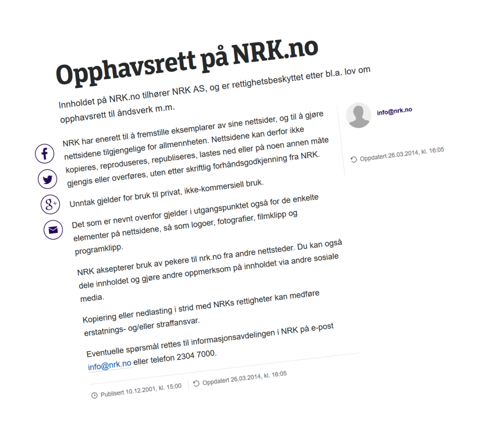

# En plass for diskusjon av NRK opphavsrett

**Oppsummering:** NRK må endre praksis til å tillate fri gjenbruk, også kommersielt, av så mye av sitt egenproduserte innhold som overhodet mulig. Et svært verdifullt første steg som er meget enkelt gjennomførbart er å åpne for gjenbruk av all tekst publisert på NRK.no av bedriftens egne journalister/ansatte og av freelancere der NRK har enerett på innholdet. Dette kan gjøres i en håndvending ved å endre ett enkelt avsnitt på NRK.no sin side om opphavsratt.

## Bakgrunn

[Dette](https://www.nrk.no/etikk/opphavsrett-pa-nrk.no-1.2843522) er NRKs svært lite inspirerende opphavsrettsside slik den fremstår i dag (juli 2016):

> 

Jeg (Bjørn T.) er ikke en gang sikker på at jeg har rett til å sitere fra siden, så jeg nøyer meg med å lime inn et skjermbilde.

Jeg (Bjørn T.) tenker NRK bør ha en strategi om å publisere så mye som overhodet mulig av sin egenproduksjon som åpen kilde. Mange NRK-ansatte mener dette er en spennende tanke, men begynner fort å problematisere rundt TV-produksjonene sine, der de bruker lisensiert musikk og andre elementer de ikke kan distribuere videre. For å skape framdrift ønsker jeg derfor i første omgang å begrense diskusjonen til å gjelde tekstlig innhold på NRK.no. Jeg mener vi kan ta et stort skritt videre kun ved å endre ett enkelt avsnitt på opphavsrettssiden; det som omhandler unntak.

### Nåværende avsnitt om unntak

> Unntak gjelder for bruk til privat, ikke-kommersiell bruk.

(Sukk... her ble det ikke en gang lest korrektur.)

### Forslag til nytt avsnitt

> Unntak gjelder: 
> 1. For privat, ikke-kommersiell bruk. 
> 2. For all artikkeltekst på nettstedet skrevet av en person med e-post-adresse som slutter med `@nrk.no`. Denne teksten er åpent lisensiert under [CC BY-SA 4.0](https://creativecommons.org/licenses/by-sa/4.0/) og kan gjenbrukes fritt av alle, også til kommersielle formål.

